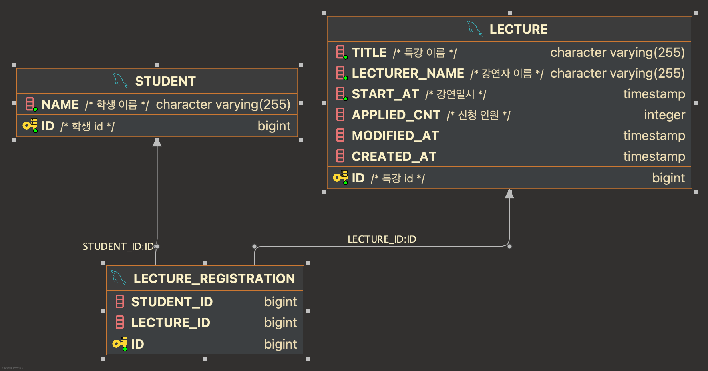

## ERD설계

저는 기능구현을 위한 최소한으로 테이블을 설계했습니다.

- lecture 테이블 : 특강 관련 정보 저장
    - title, lecturer_name, start_at : 특강관련 기본정보
    - applied_cnt : 특강 신청인원 컬럼. 최대인원제한시 비교하기 위한 컬럼

- student 테이블: 학생(사용자) 관련 정보

- lecture_registration : 특강 신청 정보
    - 신청한 특강, 학생 id 저장

